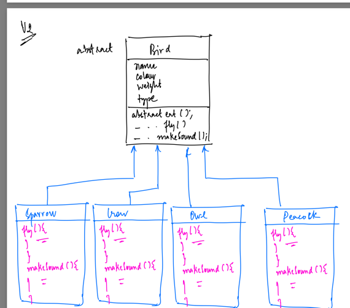
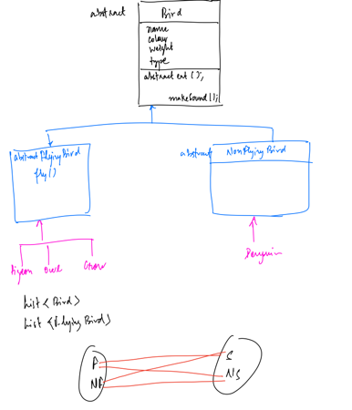
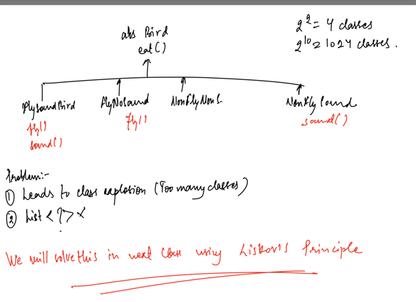
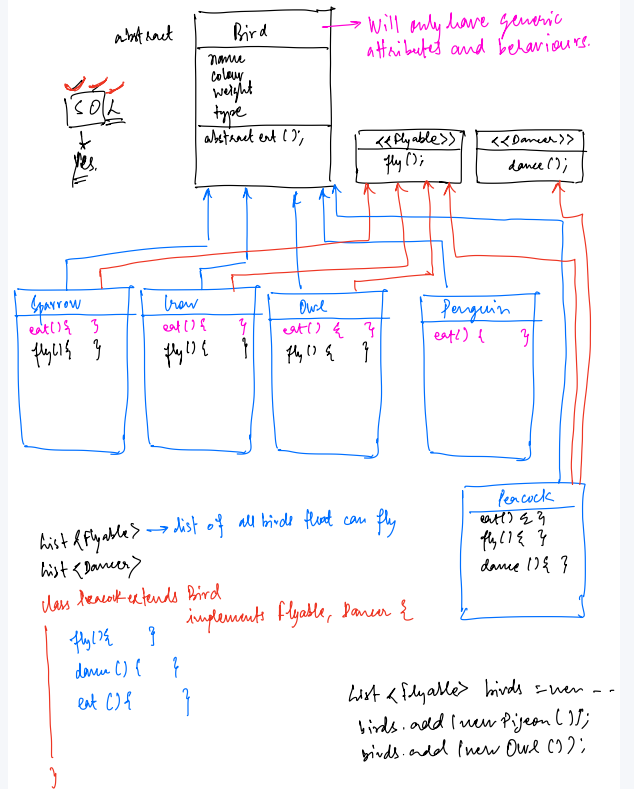
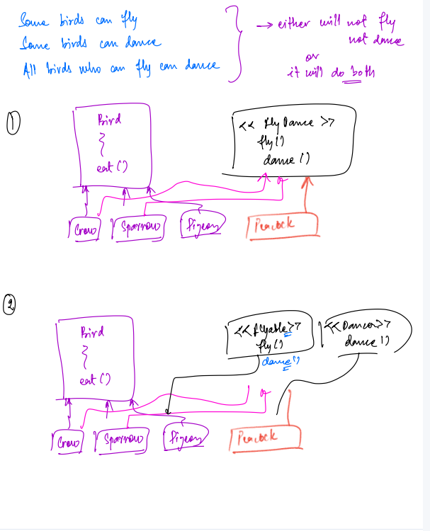
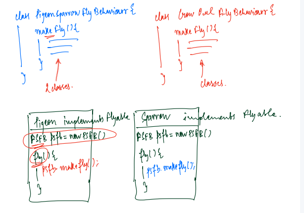
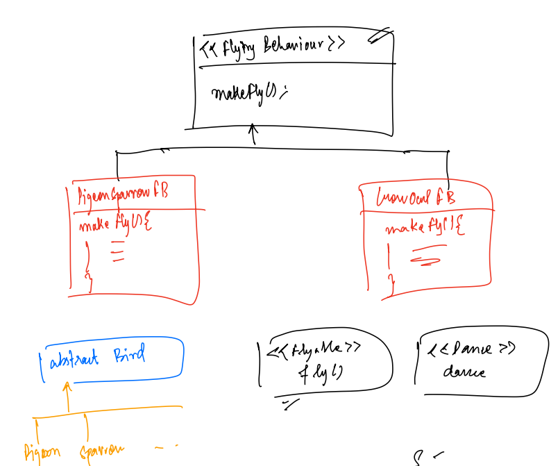
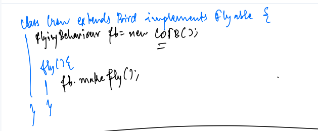

**SOLID Design Principals**

S - Single Responsibility Principle

O- Open/Close Principle

L- Liskov's Substitution Principle

I- Interface Segregation Principle

D- Dependency Inversion Principle 

---

**S - Single Responsibility Principle**

Every class/Interface/method/package should have exactly 1 responsibility
Every code unit, there should have exactly one reason to change code of that code unit


**How to identify SRP** 
1. **Multiple if else statements.**
- Not always true
- If if-else is part of business logic then its fine. 
- You need to identify subjectively


  **Problems with if-else**
- Understandability
- Very difficult to test
- Merge conflicts
- Code duplication
- Less code reuse
- It violates SRP
2. **Monster methods** 
- If a function is usually doing more that what is being intended.
3. **Commons/Utils**
- These are usually a place where a engineer cannot think where to put the code and ends up being a garbage.
- Utils/DateUtils
- Utils/CalenderUtils
- Utils/TimeUtils

**Above of these are still better when segregated.**

**O - Open Close Principle**

The code should be open for extension/extensible and closed for modification.
- easy to add new features
- but by adding new features, something should not change which is already written.

Ideal solution: If an entity does not support a behavior, it should not have a method to do that behavior
In below picture the penguin cannot fly so we should not have a behavior for penguin for that.


Interference and Abstraction can help here.

---



When solving this kind of problem, can sometimes lead to class explosion, we can solve that using Liskov's principle.

**L - Liskov's Substitution Principle**

Problem Statement:
1. Some birds demonstrate a certain behavior while other birds do not.
2. I should be able to create a list of birds that have a certain behavior eg: List<FlyingBirds>, List<NonFlying>

Some birds Have a certain behaviours,so they can implement that **interface**




The others don't have, so they don't have to implement that **interface**


**Definition:** Object of any child class should be as is substitutable in a variable of the parent type, without requiring ay code changes

NOTE:
1. All child classes should behave as their parent method wants them to do.
2. No child should give a special/different meaning to the parents' method

```java
//In the Runnable interface you have run method

class HumanRunner implements Runnable {
    
    public void run() {
        System.out.println("Human is running ");
    }
}
```
In the above example run function has a different functionality, to run something in a separate thread, but we are not doing the same thing in the child class.
Which is violating.


**I- Interface Segregation**

Based on functionality interfaces should be segregated.

1. Interfaces should be as light as possible.
2. As less methods as possible
3. Interface should have ideally one method(functional interface)
4. For all the methods which are part of an interface, just question if they logically belong to that interface.




**D- Dependency Inversion**


No 2 concrete class should directly depend on each other,they should depend on each other via an interface.





In the above example we have a problem. 
The two concrete classes Pigeon, Sparrow and class PigeonSparrowFLyBehavior are tightly coupled. Any change in makeFly() function will cause issues. 
Here Flyable is an interface.
```java
class Pigeon implements Flyable{

@Override
void fly(){
  PegionSparrowFlyBehavior pad=new PegionSparrowFlyBehavior();
  pad.makeFly();
}
}

class PegionSparrowFlyBehavior{
    void makeFly(){
    //some behavior with flying
}

interface Flyable{
       fly();
}
```






