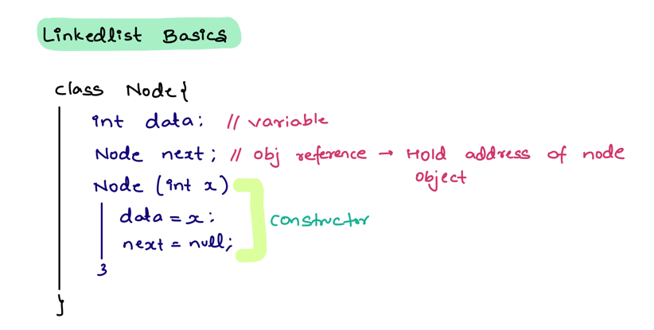
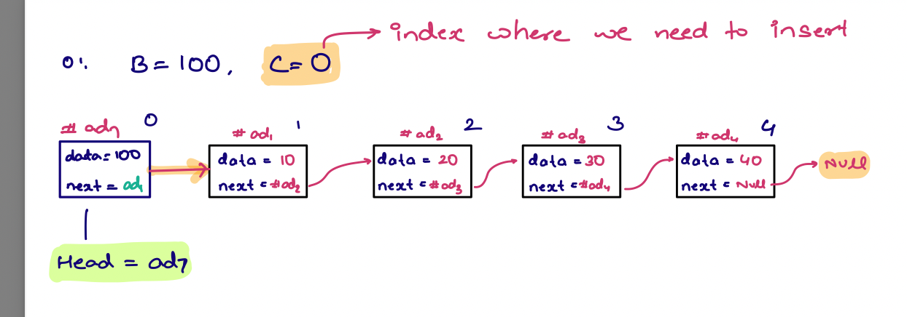
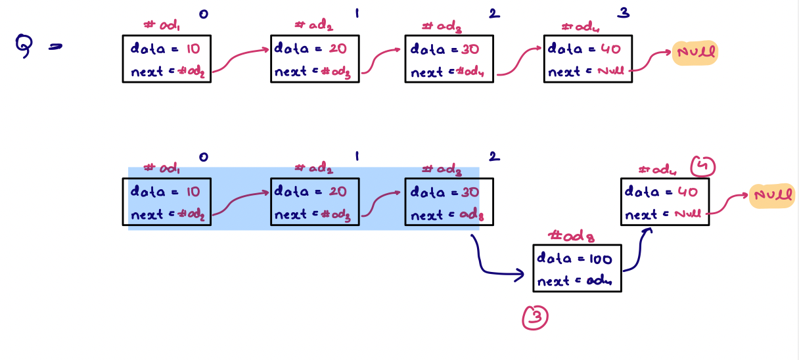
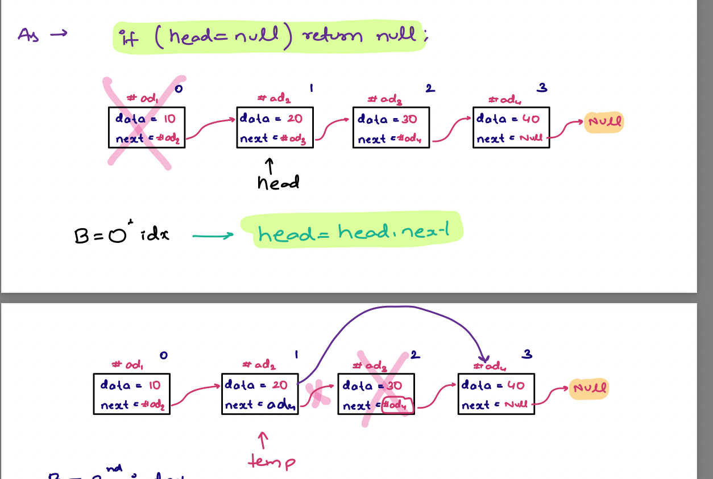
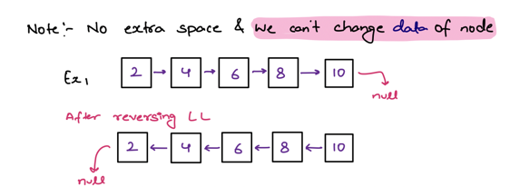
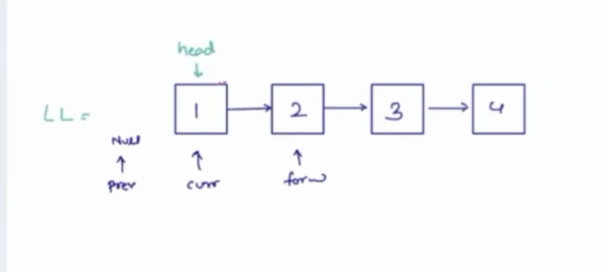
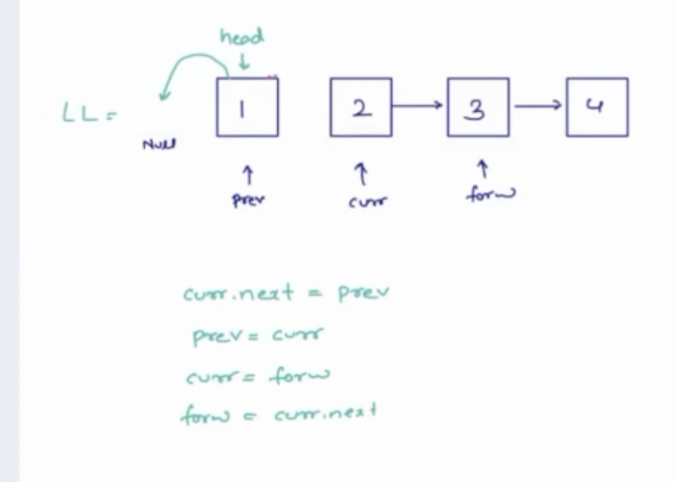
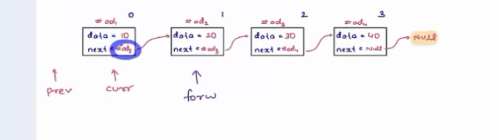
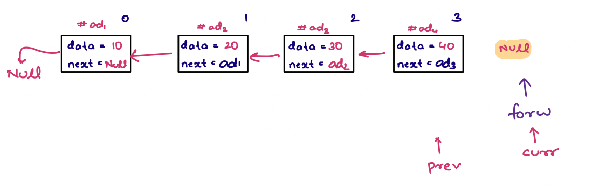

# Linked List


 ### 1. Given a head node of linked list we need to print data of linked list*

Edge case here is when head is ***null***
```
Node temp=head;
        if(temp==null){
           return;
        }
        while(temp!=null){
          print(temp.data)
          temp=temp.next
        }
```

### 2. Given the head of the node return the size of linked list

```java
Node temp=head;

int count =0;
while(temp !=null){
    count=count +1;
    temp=temp.next;
 }
return count;
```

### 3. Given a head of a linked list insert a  new node at a given position in linked list assuming the position is always within the linked list size.




*Insert the new node at the start of the linked list*

```java
Node newNode=new Node(100);
        newNode.next=head;
        head=newNode;
        return head;
```

**Insert a new node at specific index where index c=2**

**Steps**

_Create a new node._   
_Go to the c-1 position and then create a link between the new node and old node._


```java
Node newNode = new Node(100);
// Now I am at index 0 and should move my pointer to c-1 i.e 3 
        // c is the index where we want to insert so c-1= 3-1=2
int c=3;
Node temp= head;
while(temp !=null && c>1){
    temp=temp.next;
    c--;
}
// Now after the while loop the c pointer is at index 2.
// So now we create a link between the nodes
newNode.next= temp.next;
temp.next= newNode;
return head;

```

### Given a head of a linked list, delete the node at index B

**_EDGE CASE: If there is an invalid index, or you are at the last position_**
```java
if(head == null){
    return null;
}
Node temp= head;
// If we want to remove the node at index 0, then we can simply do 
head=head.next;

// If we want to remove the index at specific postion, then we have to travese to c-1 index and break the link 
Eg c=3

        Node temp=head;
        while(temp!=null && c>1){
          temp=temp.next;
          c-c-1;
        }
        if(temp ==null) return head  // Invalid index of c 
        temp.next=temp.next.next;
        return head;
```



## Reverse a linked list 
### Given a linked list reverse entire linked list & return the head node. We can only change the reference of the node 

Note : No extra space has to be used  & we cannot change the value of the node 



### Idea

Create 3 pointers where we have prev, current, forward

Create 3 pointers **prev, curr, forw** where prev is null in the beginning


Move your **curr.next to prev** and **prev pointer to curr** and **cur to forw** and **forw to curr.next** until **curr** is not null



```java
if(head == null || head.next==null){ // head== null means 0 nodes and head.next==null means 1 node.
        return head;
}
Node prev= null
Node curr= head
while(curr!=null){
    Node forw=curr.next;
    curr.next=prev;
    prev=curr;
    curr=forw;
}
head=prev; // at this point forw is already null and curr is already null 
return head
```





