# Linked List


 ### 1. Given a head node of linked list we need to print data of linked list*

Edge case here is when head is ***null***
```
Node temp=head;
        if(temp==null){
           return;
        }
        while(temp!=null){
          print(temp.data)
          temp=temp.next
        }
```

### 2. Given the head of the node return the size of linked list

```java
Node temp=head;

int count =0;
while(temp !=null){
    count=count +1;
    temp=temp.next;
 }
return count;
```

### 3. Given a head of a linked list insert a  new node at a given position in linked list assuming the position is always within the linked list size.


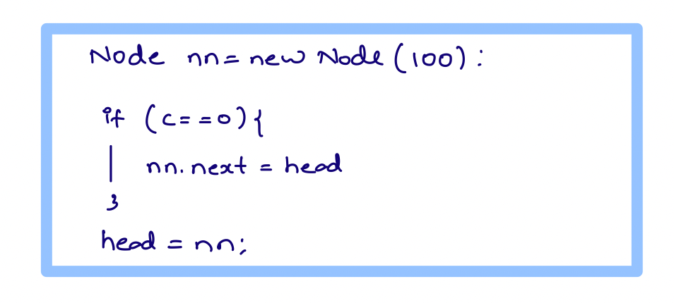
*Insert the new node at the start of the linked list*

```java
Node newNode=new Node(100);
        newNode.next=head;
        head=newNode;
        return head;
```

**Insert a new node at specific index where index c=2**

**Steps**

_Create a new node._   
_Go to the c-1 position and then create a link between the new node and old node._


```java
Node newNode = new Node(100);
// Now I am at index 0 and should move my pointer to c-1 i.e 3 
        // c is the index where we want to insert so c-1= 3-1=2
int c=3;
Node temp= head;
while(temp !=null && c>1){
    temp=temp.next;
    c--;
}
// Now after the while loop the c pointer is at index 2.
// So now we create a link between the nodes
newNode.next= temp.next;
temp.next= newNode;
return head;

```

### Given a head of a linked list, delete the node at index B

**_EDGE CASE: If there is an invalid index, or you are at the last position_**
```java
if(head == null){
    return null;
}
Node temp= head;
// If we want to remove the node at index 0, then we can simply do 
head=head.next;

// If we want to remove the index at specific postion, then we have to travese to c-1 index and break the link 
Eg c=3

        Node temp=head;
        while(temp!=null && c>1){
          temp=temp.next;
          c-c-1;
        }
        if(temp ==null) return head  // Invalid index of c 
        temp.next=temp.next.next;
        return head;
```


## Reverse a linked list 
### Given a linked list reverse entire linked list & return the head node. We can only change the reference of the node 

Note : No extra space has to be used  & we cannot change the value of the node 


### Idea

Create 3 pointers where we have prev, current, forward

Create 3 pointers **prev, curr, forw** where prev is null in the beginning


Move your **curr.next to prev** and **prev pointer to curr** and **cur to forw** and **forw to curr.next** until **curr** is not null


```java
if(head == null || head.next==null){ // head== null means 0 nodes and head.next==null means 1 node.
        return head;
}
Node prev= null
Node curr= head
while(curr!=null){
    Node forw=curr.next;
    curr.next=prev;
    prev=curr;
    curr=forw;
}
head=prev; // at this point forw is already null and curr is already null 
return head
```


### Given a head of linked list delete the mid of the linked list 

**Approach**


Initialize the slow and fast pointers with head. 
```java
if(head.next==null){ // There is only 1 node in LL
    return null
}

Node slow= head;
Node fast= head;

while(fast!=null && fast.next!=null){
    slow=slow.next;
    fast= fast.next.next;
}
slow.next= slow.next.next; // at this point we are at the middle of the linked list.
        
return head;
``` 

### Given two sorted linked lists merge them to have a single sorted linked list.

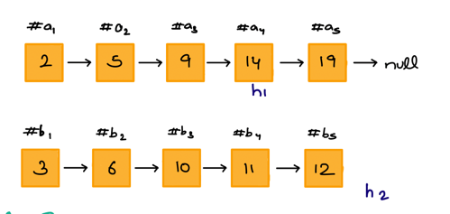

**Expected Output**
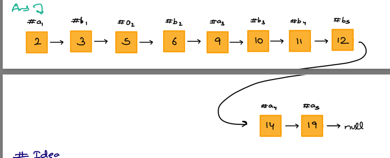


### Idea
Compare the data on each iteration and the traverse a temp variable across each linked list to form the merge of two lists


The two pointers h1 and h2 are used to for comparing the value and the temp traverses across the linked list.

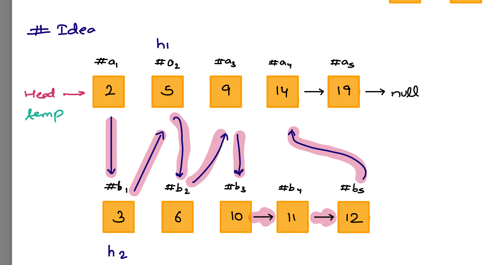

```java
if(h1=null) return h2;
if(h2=null) return h1;

Node head, temp=null;

if(h1.data<h2.data){
    head=h1;
    temp=h1;
    h1=h1.next;
}else{
    head=h2;
    temp=h2;
    h2=h2.next;
}

while(h1!=null && h2!=null){
    if(h1.data < h2.data){
        temp.next=h1;
        h1=h1.next;
        temp=temp.next;
    } else{
        temp.next=h2;
        h2=h2.next;
        temp=temp.next;
    }
}
if(h1!=null){ // at this point of time h2 is null or no other nodes available
    temp.next=h1;
}
if(h2!=null){// at this point h1 is null and no other nodes in h1
    temp.next=h2;
}
return head;
```

### Rearrange a Linked list


Question 
Its kind of spiral 


_Idea_

Find the mid of the linked list 

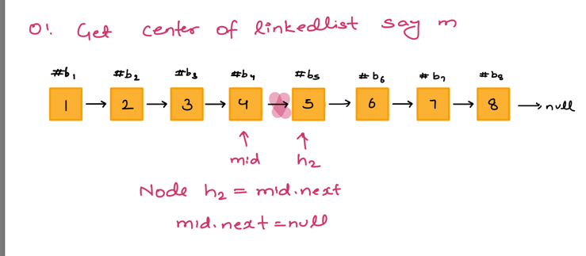

Reverse the 2nd half of the linkedlist
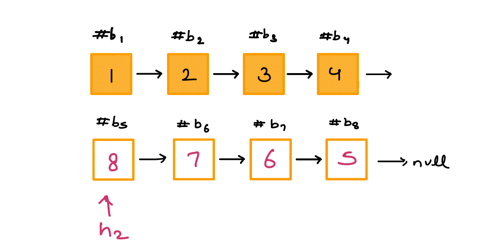

Now merge the linked lists.

###03 Given a head node of Linkedlist check cycle detection

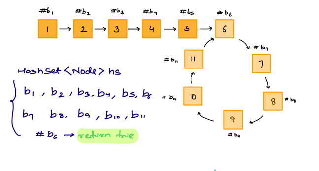

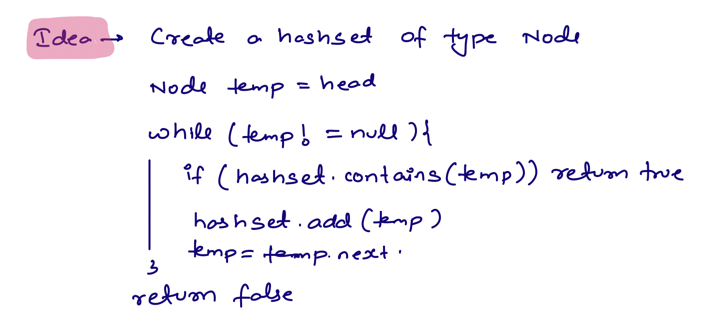

_Optimised Solution_ 


Create two pointers slow and fast and move slow by 1 and move fast by 2. If at any point of time both these pointers meet, then we can say that cycle is present in the linked list

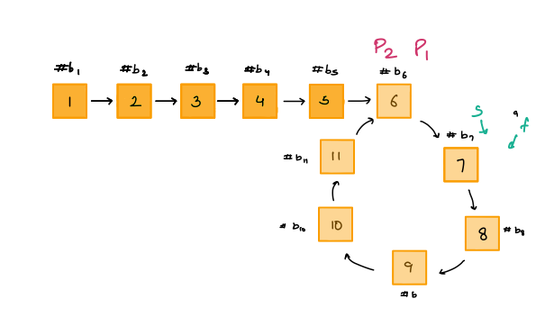

````java
if(head==null) return false; 

Node slow=head;
Node fast=head;

while(fast!=null && fast.next!=null){
        slow=slow.next;
        fast=fast.next.next;
        if(slow==fast){
            return true;
        }
}
return false;
````

On the similar node if you have to find the start **node** of the cycle, then you have to choose **head** as pointer P1 and cycle start as pointer P2 and move these one at a time. Once they meet that node is called the node of the **cycle start**
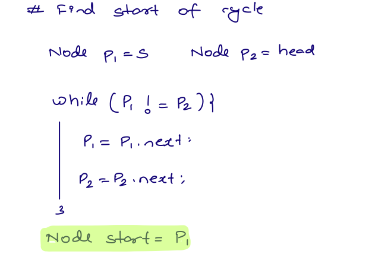

````java

Node p1=detectCycle(head); // first check if cycle is present 
Node start= getStartOfCycle(p1);
// To remove the cycle in the linked list
// removeCycle(start);


private void removeCycle(Node start){
    Node temp= start;
    while(temp.next!=start){
        temp=temp.next;
    }
    temp.next=null;
}


private Node getStartOfCycle(Node p1){
    if(p1=null){
        return null; // No cycle detected in the linked list
    }    
    Node p2= head;
    while(p1!=p2){ // Once both p1 and p2 are at the same location
        p1=p1.next;
        p2=p2.next;
    }
    return p1; // Start of the cycle
}


private Node detectCycle(Node head){
        if(head==null || head.next==null) return null;

        Node slow=head;
        Node fast=head;

        while(fast!=null&&fast.next!=null){
        slow=slow.next;
        fast=fast.next.next;
             if(slow==fast){
              return slow; // you can return either slow or fast pointer here.
             }
        }
        return null;
}
return false;
````

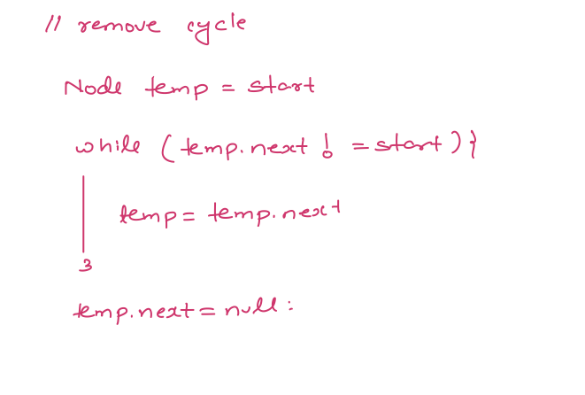


