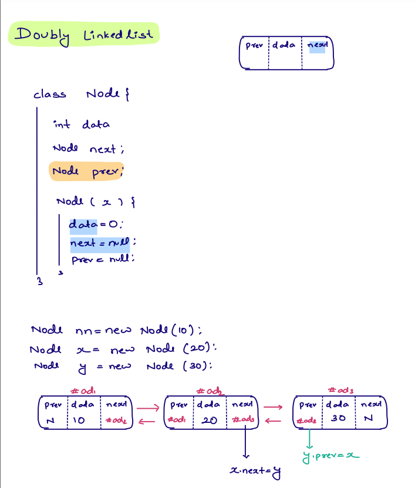
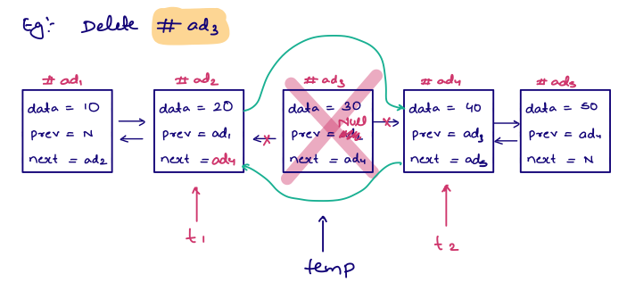
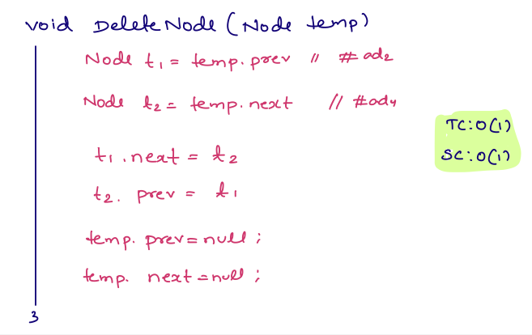
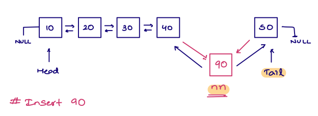
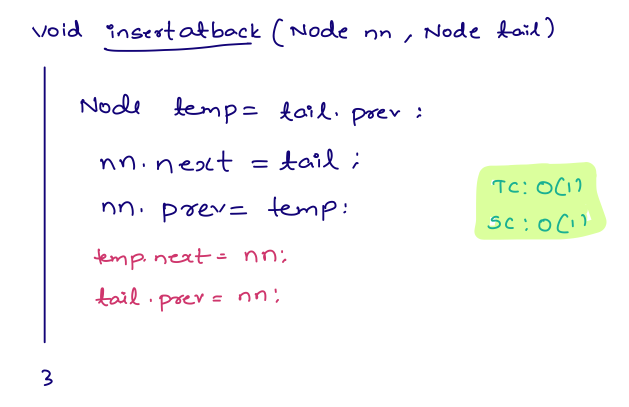
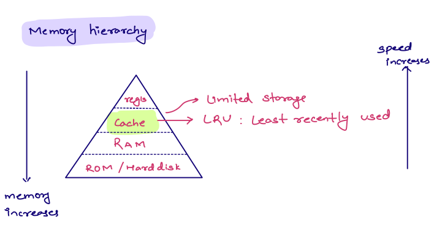
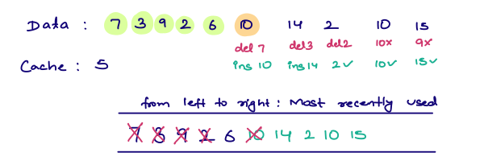
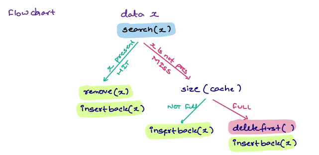
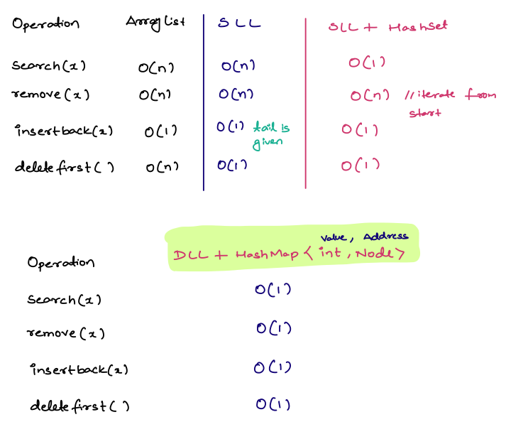

# Doubly Linked List 

## Basics 



## 1. Delete a given node from DLL
Note: The node is not head/tail node 


```java
void deleteNode(Node node){
    
    // Iterate to the node you want to delete i.e temp in this case
    Node t1=temp.prev;
    Node t2=temp.next;
    
    t1.next=t2;
    t2.prev=t1;
    
    temp.next=null; // Not necessary good to have
    temp.prev=null; // Not necessary good to have
}
```


## 2. Insert a new node just before the tail of doubly linked list 



```java

void insertAtBack(Node newNode, Node tail){
    
    Node t1= tail.prev;
    newNode.next=tail;
    newnNode.prev=t1;
    t1.next=newNode;
    tail.prev=newNode;
}
```


# Memory hierarchy in computers

### LRU Cache
Regis: Registers are storing based on bits and are extremely fast in processing.
Cache: Cache is limited amount of storage and we need to have an algorithm to make this efficient storage.

**ALGO** -- LEAST  RECENTLY USED(LRU)



**Implementation of LRU**


_Steps_

- In the cache either the data can be present or missing.
- If the data(X) is present then we need to modify by deleting old data and inserting new element data as least recently used element.
- If data(X) is not present check the size of the cache. If the cache is available add the element.
- If cache is full, delete the least recently used element from first and insert element to the cache.
 


## _**Datastructures used for the above implementation and why**_


